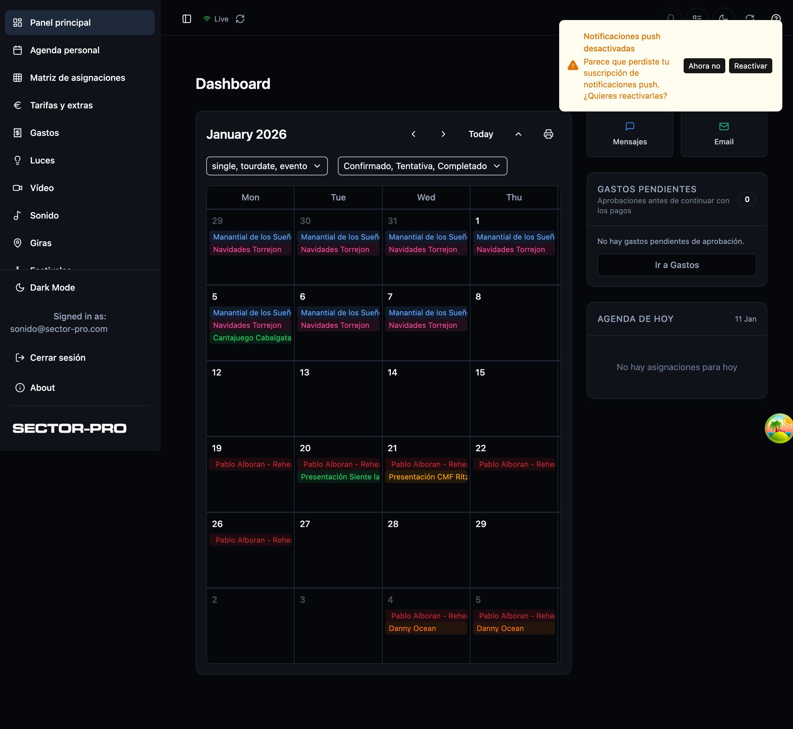
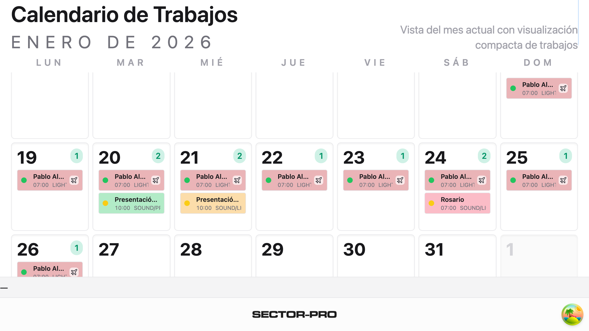

# Área Técnica (Sector Pro)

**Production:** https://sector-pro.work

Área Técnica is Sector Pro’s technical operations platform for live events, festivals and tours. It consolidates workflows that normally live in spreadsheets, emails, WhatsApp and external tools into a single **mobile‑first PWA** (also shipped as **iOS/Android apps via Capacitor**).

---

## Who is it for? (roles)
- **Admin / Management:** planning, staffing, approvals, documentation, communications
- **Logistics:** logistics workflows and expenses
- **House Techs:** technician dashboard + availability/unavailability
- **Technicians:** mobile Tech App for assignments, documents, timesheets and messaging
- **Wallboard users:** digital signage / operational dashboards

Roles in the system: `admin`, `management`, `logistics`, `technician`, `house_tech`, `wallboard`, `oscar`.

---

## Key capabilities (high level)
- **Jobs / Projects:** job lifecycle, departments, documents, status and ops tooling
- **Tours:** dates, crew assignments, presets, logistics, scheduling, docs, rate tooling
- **Festivals:** festival management, artist intake (public tokenized forms), riders/docs, scheduling, gear planning
- **Staffing matrix:** crew assignment matrix + conflict tooling
- **Hoja de Ruta (Roadmap / Day Sheet):** structured event sheet with **PDF/XLS exports**, plus weather & restaurant utilities
- **Global Tasks:** cross‑department task system with assignees, due dates, attachments, linking to jobs/tours
- **Timesheets & Rates Center:** rates/extras, overrides, approvals, payout summaries
- **Technician App (`/tech-app`):** mobile UI for assignments, docs, messages, availability and timesheets
- **Wallboard (`/wallboard`):** configurable signage presets + **public tokenized access**
- **SoundVision library:** Mapbox-based venue map, uploads, ratings/reviews, access workflow
- **Communications:** web/native push notifications, WhatsApp group/message automation, corporate email automation
- **Integrations:** Flex Rental Solutions (folders, crew sync, work orders), technician **ICS calendars**

---

## Screenshots
A curated gallery lives in `docs/screenshots/`.

- Dashboard
  - 
- Festival Management
  - 
- Tour Management
  - 
- Hoja de Ruta / Day Sheet
  - 
- Technician experience
  - 
- Crew Assignment Matrix
  - 
- Technical tools
  - 
- Digital signage
  - 

---

## Tech stack
- React 18 + TypeScript
- Vite 6
- Tailwind + shadcn/ui
- TanStack React Query
- Supabase (Auth, DB, Storage, Edge Functions)
- Capacitor (iOS/Android wrapper)

---

## Local development
```bash
npm install --legacy-peer-deps
npm run dev
# http://localhost:8080
```

Environment variables (Cloudflare):
- `VITE_SUPABASE_URL`
- `VITE_SUPABASE_ANON_KEY`
- `VITE_SUPABASE_FUNCTIONS_URL` (if applicable)
- `VITE_VAPID_PUBLIC_KEY` (web push)

---

## Mobile (Capacitor)
```bash
npm run cap:ios
npm run cap:android
```

---

## Documentation
Start here: **`docs/README.md`** (index of product/ops/engineering docs).

---

## Notes / constraints
- Maintain compatibility with the existing Supabase schema.
- date-fns must remain at `^3.6.0`.
- Vite is pinned (see `package.json`).
