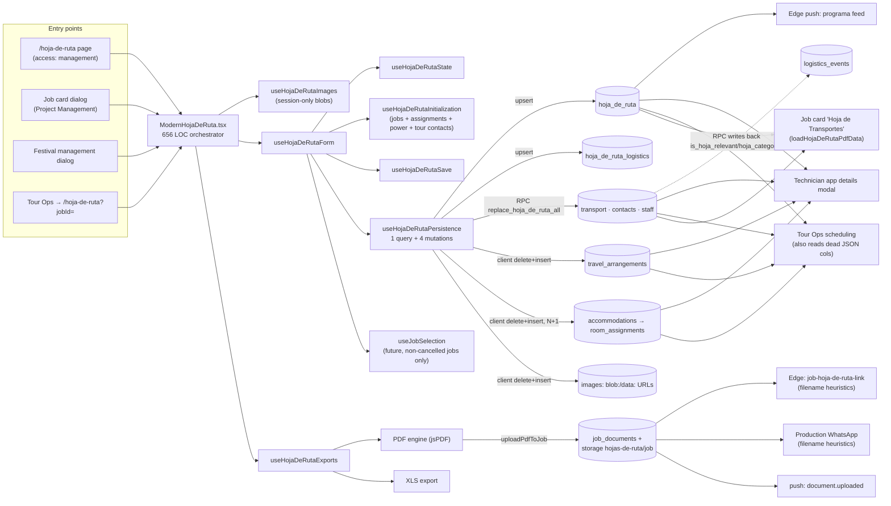
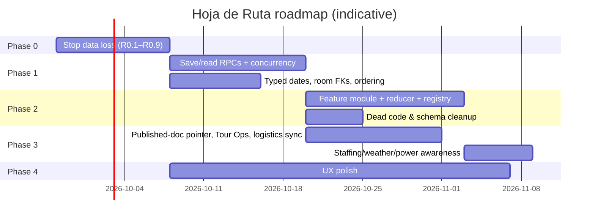

# Hoja de Ruta — Module Audit & Enhancement Roadmap

**Date:** 2026-09-26 · **Branch audited:** `main` @ `33b753f` · **Scope:** everything that reads, writes, renders or distributes a Hoja de Ruta.

---

## 1. Executive summary

The Hoja de Ruta works for the happy path: one manager, one session, full-document export. Outside that path it loses data, publishes the wrong document, and drifts from the modules it is supposed to summarise.

**Overall health: 🟠 fragile.** The PDF engine and the staff-merge logic are in decent shape and tested. The persistence layer, the state model and the cross-module contracts are not.

### Top findings (fix first)

| # | Finding | Severity | Impact |
|---|---------|----------|--------|
| B1 | Venue photos and venue map are saved as `blob:`/`data:` URLs, never reloaded, and wiped on every save | 🔴 Critical | Data loss; photos only exist in the browser session that added them |
| B2 | Restaurant selections are never persisted | 🔴 Critical | Data loss; the tab silently resets every visit |
| B3 | Exporting a **single section** PDF replaces the **published full** Hoja de Ruta and notifies the crew | 🔴 Critical | Crew, WhatsApp links and the tech app get e.g. only "Contactos" |
| B4 | Saving is 4 separate client-orchestrated writes, 3 of them "delete all then insert" | 🔴 High | A network blip mid-save deletes travel/hotels/images; row IDs churn every save |
| B5 | `isDirty` means "has any content", not "changed" | 🟠 High | "Cambios sin guardar" is always shown; every preview writes to the DB and logs activity |
| B6 | No concurrency control; last writer silently replaces child collections | 🟠 High | Two managers editing the same job overwrite each other |
| B7 | Staff list is seeded from **all** assignments, including invited and declined | 🟠 High | Declined technicians (with DNI) appear in the published PDF |
| P1 | The published PDF includes every crew member's DNI and is distributed via 1-year bearer links | 🟠 High (privacy) | DNI exposure to the whole crew and anyone a link is forwarded to |

The roadmap in §10 sequences the work into five phases: **stop data loss → make persistence atomic → refactor the architecture → fix integrations → UX polish**, with tests as an exit gate for each phase.

---

## 2. Scope and method

Code read end-to-end: the page/dialog component, all hooks, persistence, PDF/XLS engines, the attachment/link resolution (client and Edge), the programa push feed, all Hoja migrations and RLS policies, and every consumer outside the module (tour ops, technician app, job cards, logistics, festival dialog).

| Area | Files | LOC (approx.) |
|------|-------|---------------|
| UI (`src/components/hoja-de-ruta/**`) | 27 | 4,600 |
| Hooks (`useHojaDeRuta*`, `src/hooks/hoja-de-ruta/**`) | 7 | 2,100 |
| PDF engine (`src/utils/hoja-de-ruta/**`) | 38 | 4,700 |
| XLS export (`src/utils/hojaDeRutaExport.ts`) | 1 | 650 |
| Edge (`job-hoja-de-ruta-link`, `_shared/hoja*`, `push/programaFeed*`) | 6 | 900 |
| Migrations touching `hoja_de_ruta*` | 20 | — |

Baseline: the 12 existing Hoja test files (46 tests) pass. None of them cover persistence round-trips, save orchestration, images, restaurants or dirty tracking.

### What is in good shape

- **Staff ↔ assignment merge** (`staffSync.ts`) is careful, handles legacy rows, and is well tested.
- **Transport timestamps** are converted to/from Europe/Madrid correctly (`toSafeTimestamptz`, `toDateTimeLocalInMadrid`).
- **Transport/contacts/staff** already save through one atomic RPC (`replace_hoja_de_ruta_all`) with role checks.
- **Print exclusions** are persisted and normalised, including a legacy expansion map.
- **Producer claims** are merged into contacts for editor exports.
- **Google Places** is only called through Edge Functions, so the key stays server-side.
- **Signed Hoja links** are HMAC-signed, rate-limited and redirect to short-lived signed storage URLs.
- The PDF engine is **lazy-loaded** and was migrated onto the shared report system chrome.

---

## 3. Architecture as it is today

### Structural observations

- **One god component** owns tabs, progress, status badges, image state, export state and three dialogs. It drills about 60 props into 10 section components.
- **State is split across three hooks.** Setters are passed as positional arguments (11 in `useHojaDeRutaInitialization`, 12 in `useHojaDeRutaSave`). Several are typed `any`.
- **Two parallel section taxonomies.** `HOJA_DE_RUTA_PDF_SECTIONS` has 10 ids for tabs and section exports. `HOJA_DE_RUTA_PRINT_SECTIONS` has 14 ids for exclusions and the full export. They group content differently (see B18).
- **Persistence is half-migrated.** Three child tables go through an atomic RPC. Three more use client-side delete-then-insert. `hoja_de_ruta` and `hoja_de_ruta_logistics` are separate upserts.
- **Reads are duplicated.** The editor fetch, `loadHojaDeRutaPdfData`, the tech-app modal and tour ops each hand-roll their own multi-query read of the same aggregate, each with a different subset of fields.

---

## 4. Data model

### Tables in use

| Table | Written by | Notes |
|-------|-----------|-------|
| `hoja_de_ruta` | editor upsert on `job_id` | `status`, `document_version`, `approved_*`, `created_by` never written |
| `hoja_de_ruta_logistics` | editor upsert | 1:1 with hoja; could be columns |
| `hoja_de_ruta_transport` | RPC | timestamptz ✅ |
| `hoja_de_ruta_contacts` | RPC | no `email`, no ordering column |
| `hoja_de_ruta_staff` | RPC; `remove_assignment_with_timesheets` deletes rows | DNI stored; no ordering column |
| `hoja_de_ruta_travel_arrangements` | client delete+insert | times stored as **text** |
| `hoja_de_ruta_accommodations` | client delete+insert (N+1) | `check_in/out` stored as **text** |
| `hoja_de_ruta_room_assignments` | client insert | `staff_member*_id` is text holding either a technician UUID **or an array index** |
| `hoja_de_ruta_images` | client delete+insert | `image_path` holds `blob:` or base64 `data:` URLs, not storage paths |

### Dead or orphaned schema

| Object | Status |
|--------|--------|
| `hoja_de_ruta_restaurants` (with RLS + trigger) | never read or written |
| `hoja_de_ruta_equipment`, `hoja_de_ruta_templates` | never read or written |
| `hoja_de_ruta_rooms`, `hoja_de_ruta_travel` | only touched by `background-job-deletion` |
| `hoja_de_ruta.restaurants_info`, `hotel_info`, `logistics_info`, `local_contacts` | **read by Tour Ops**, never written by the editor (see I4) |
| `hoja_de_ruta.alerts`, `crew_calls`, `venue_technical_specs` | unused |
| Duplicate FKs (`fk_hoja_de_ruta_*_main` + `hoja_de_ruta_*_hoja_de_ruta_id_fkey`) and duplicate-column indexes (`(hoja_de_ruta_id, hoja_de_ruta_id)`) | schema noise |

### Type-level debt (`src/types/hoja-de-ruta.ts`)

`EventData` carries about 15 fields that are never edited or persisted, such as `eventCode`, `budget`, `estimatedAttendees` and `venueContact`. The XLS export still prints them as empty rows. `ComprehensiveEventData`, `EnhancedStaff`, `EnhancedEventData`, `HojaDeRutaTemplate` and the legacy `PDFGenerationOptions` (typed `toast?: any`) are unused.

---

## 5. Integration with other modules

| Module | Direction | Mechanism | Issues |
|--------|-----------|-----------|--------|
| **Jobs** | read | `useJobSelection`, one-off `jobs` + `locations` fetches | Selector excludes past, completed, cancelled and `evento`/`dryhire`/`tour` jobs. Exports resolve title and date from that list (B9). |
| **Staffing / assignments** | read on init, server delete | nested `job_assignments(profiles(...))` select; `remove_assignment_with_timesheets` deletes hoja staff rows | Ignores assignment status (B7). Raw role codes (B8). Server delete does not remap room assignments (B11). New assignments only appear on the next open. |
| **Power tables** | read | `power_requirement_tables` → text | Copied as free text. Never refreshed once saved except via the misleading "Cargar datos del trabajo" button (B17). |
| **Tours** | read | `tours.tour_contacts` merged into contacts | Fine. `tour_date_id` is never set on the hoja, so Tour Ops relies on its `job_id` fallback. |
| **Tour Ops** | read + realtime | Custom multi-query; the tour management route subscribes to 6 hoja tables | Reads JSON columns the editor never writes (I4). Delete+insert saves cause realtime storms on this view. |
| **Logistics events** | bidirectional | Manual "Importar" button; `replace_hoja_de_ruta_transport` writes `is_hoja_relevant`/`hoja_categories` back | Import ignores the driver matrix and fleet (I1). No drift detection. Two-way sync is undocumented. |
| **Driver matrix / fleet** | none | — | Driver name, phone and plate stay blank or manual even when assigned in `/logistics?tab=drivers` (I1). |
| **Producer claims** | read at export | `fetchJobProducerContacts` + `mergeProducerClaimsIntoContacts` | Missing from the job-card "Hoja de Transportes" path (I2). |
| **Job documents / storage** | write | `uploadPdfToJob` → `hojas-de-ruta/{jobId}/` + `job_documents` | Section exports overwrite the published full document (B3). "Latest hoja" found by filename heuristics duplicated client/Edge (I3). |
| **Push** | write | `document.uploaded` broadcast on every export; `programaFeed` reads `program_schedule_json` | Crew is notified for section exports too. Programa row IDs are backfilled on read, so unsaved hojas can have unstable IDs. |
| **Activity log** | write | `trg_log_hoja_update` on every `hoja_de_ruta` UPDATE | Every preview auto-saves (B5), so the feed fills with `hoja.updated`. |
| **Technician app** | read | Direct table reads via RLS for confirmed techs | Accommodation IDs change on every save. Room staff refs that are indexes cannot be resolved by technicians. |
| **Weather** | read | Open-Meteo via `getWeatherForJob(venue, eventDates string)` | Parses the localized free-text date. Saved forecast is never refreshed (B16). |
| **Places (restaurants/photos)** | read | Edge `place-restaurants`, `place-photos` | Auto-search on every Restaurants tab visit. Venue photos are fetched on every mount. |

---

## 6. Bugs

Severity: 🔴 critical/high data or distribution bug · 🟠 functional bug · 🟡 minor.

### 🔴 B1 — Venue images are never really persisted
- `useHojaDeRutaImages.ts:26,46` creates `blob:` object URLs. `appendVenuePreviews` (`:91`) adds base64 `data:` URLs from Places photos.
- `ModernHojaDeRuta.tsx:92-112` saves those strings as `image_path`. Nothing uploads the files to storage.
- `useHojaDeRutaPersistence.ts:716-744` deletes all image rows on every save and re-inserts only the current session's previews.
- The fetch returns `images`, but nothing hydrates `imagePreviews` from them.

**Result:** after a reload the venue photos and map are gone. The next save deletes the old rows. `blob:` rows are dead links. `data:` rows bloat the table with base64. `loadHojaDeRutaPdfData` only accepts `data:` venue maps, which is the symptom of this bug, not a fix.

### 🔴 B2 — Restaurant selections are never saved
`saveHojaDeRuta` has no restaurant field. The fetch does not read one. Initialization reads `savedEventData?.restaurants`, which is always undefined. `hoja_de_ruta_restaurants` is unused. Selections vanish on reload, and full PDFs generated in a later session have no restaurants. `ModernRestaurantSection.tsx:79-84` also re-runs the Places search every time the tab mounts.

### 🔴 B3 — Section export overwrites the published Hoja de Ruta
`handleGenerateSectionPDF` → `generatePDF` → `PDFEngine.generate()` → `uploadPdfToJob(jobId, blob, filename)` with the default kind `hoja_de_ruta` (`pdf-engine.ts:413`). `uploadPdfToJob` then deletes every previous document under `hojas-de-ruta/{jobId}/` (`pdf-upload.ts:72,134`) and broadcasts `document.uploaded`.

**Result:** exporting "Contactos" replaces the full document that `job-hoja-de-ruta-link`, the production WhatsApp message and the tech app serve, and pushes a notification to the crew.

### 🔴 B4 — Non-atomic, multi-request save
`handleSaveAll` runs the main upsert, the logistics upsert, the child RPC, and then three parallel client-side delete+insert mutations (`useHojaDeRutaPersistence.ts:525-563, 609-676, 717-744`).
- A failure after a delete loses the whole collection.
- `Promise.all` can leave travel saved and hotels deleted.
- Accommodations are inserted one by one with a round-trip each (`:625`).
- Every save gives accommodations, rooms, travel and images new IDs. This breaks the tech-app query keys and fires delete+insert realtime events on six tables that Tour Ops subscribes to.

### 🟠 B5 — Dirty tracking is "has content", computed twice
`useHojaDeRutaState.ts:45-63` (effect) and `useHojaDeRutaForm.ts:157-177` (memo) both return true whenever the form has data.
- The "💾 Cambios sin guardar" badge is effectively permanent.
- `saveBeforePdfGeneration` (`useHojaDeRutaExports.ts:126-130`) saves on **every** preview or export when `isDirty || hasSavedData`. Each save bumps `last_modified`, logs `hoja.updated`, fires realtime, and shows a success toast. Preview fails outright if the event name is empty.
- There is no unsaved-changes guard. Closing the job-card or festival dialog discards edits silently.

### 🟠 B6 — Last write wins, silently
`document_version` is never incremented. The editor route subscribes only to `jobs` and `job_departments`. Child collections are fully replaced on save. Two editors on the same job overwrite each other with no warning.

### 🟠 B7 — Staff seeded from every assignment status
`useHojaDeRutaInitialization.ts:172` selects all `job_assignments` with no `status` filter. Invited and declined technicians are added to the staff list, and with them their DNI in the PDF. RLS for technicians and the programa feed both use `confirmed`, so the modules disagree about who is on the job.

### 🟠 B8 — Staff position shows raw role codes
`position: assignment.sound_role || assignment.lights_role || assignment.video_role || "Técnico"` (`:190`) stores codes like `SND-FOH-R` instead of `labelForCode(...)`. It also keeps only the first department's role and ignores `production_role`. `role: "house_tech"` (`:193`) is hardcoded for everyone.

### 🟠 B9 — Past, completed and `evento` jobs break the editor and exports
`useJobSelection.ts:50-52` returns only jobs with `end_time >= now`, type in `single|festival|ciclo|tourdate`, and status `Tentativa|Confirmado|null`. Exports look up title and date in that list (`useHojaDeRutaExports.ts:123`). For any other job opened from a job card, Tour Ops or the festival dialog, the PDF header, footer and filename lose the job title and date, and the selector shows blank.

### 🟠 B10 — Deep link shows an unusable job selector
`/hoja-de-ruta?jobId=…` (used by Tour Ops) sets `routedJobId`. The lock effect (`ModernHojaDeRuta.tsx:156-160`) reverts any change, but `hideJobSelection={!!jobId}` (`:490`) only checks the prop, so the selector is visible and does nothing.

### 🟠 B11 — Room assignments can point at the wrong person
Manual staff are referenced by **array index** (`staffOptionValue`). Staff rows are read with no `ORDER BY` and have no position column (`useHojaDeRutaPersistence.ts:169`). `remove_assignment_with_timesheets` deletes staff rows server-side without touching rooms. Index references can drift to another person.

### 🟠 B12 — Mixed date typing
Travel `pickup/departure/arrival_time` and hotel `check_in/out` are `text`. Transports are `timestamptz`. `eventDates` is a localized free-text string (`toLocaleDateString('es-ES')` in the **browser** timezone, `useHojaDeRutaInitialization.ts:76-77`) that the weather module later re-parses with regexes.

### 🟠 B13 — Default schedule text is wrong and in English
`schedule: "Load in: <job start time>"` (`:116, :352`) labels the job start as load-in and is not Spanish.

### 🟠 B14 — Job-card "Hoja de Transportes" omits producer contacts
`loadHojaDeRutaPdfData` maps contacts without `mergeProducerClaimsIntoContacts`. The editor path merges them. This breaks the rule that producers appear on every job-facing document.

### 🟠 B15 — Logistics import leaves driver data empty
`ModernTransportSection.tsx:136-160` maps logistics events with `driver_name/phone: undefined` and ignores `transport_driver_assignments`, `fleet_vehicles` and the event location. See also I1.

### 🟠 B16 — Stale weather is printed forever
Weather auto-fetches only when none is saved (`ModernWeatherSection.tsx:76`). Once saved, a forecast from weeks ago is printed with no `fetched_at` and no refresh policy.

### 🟠 B17 — "Cargar datos del trabajo" only reloads power requirements
`autoPopulateFromJob` returns `{ powerRequirements }` only. `autoPopulateBasicJobData`, which re-seeds from the job, is exported but never used.

### 🟠 B18 — Full export and section export disagree
The full export honours `printExcludedSections` and prints power and aux-needs as their own sections. Section export ignores exclusions, bundles aux-needs under "Evento" and power under "Programa", and always titles logistics "Logística" whatever it contains.

### 🟡 B19 — Double toasts
`PDFEngine.generate()` toasts success or error (`pdf-engine.ts:44,53`), and `handleGeneratePDF` toasts again (`useHojaDeRutaExports.ts:222-232`).

### 🟡 B20 — English error text reaches users
`'Event name is required'` and `'Hoja de ruta not found. Please save the main data first.'` (`useHojaDeRutaPersistence.ts:352,519,603,711`) are shown verbatim in the save error toast.

### 🟡 B21 — Filename timestamp is UTC
`pdf-engine.ts:398-400` uses `toISOString()`, so a 00:30 Madrid export is named with the previous day.

### 🟡 B22 — Silent no-op save
When the payload signature is unchanged, `handleSaveAll` returns without feedback (`useHojaDeRutaSave.ts:127-130`).

### 🟡 B23 — Festival dialog embeds the non-embedded layout
`FestivalManagementDialogs.tsx:161` omits `embedded`, so a `min-h-screen` page with a sticky `z-50` header renders inside a dialog.

### 🟡 B24 — Redundant work on job change
Both `useHojaDeRutaState` and `useHojaDeRutaForm` reset on `selectedJobId` change. Progress is computed with `useEffect` + `setState` instead of `useMemo`, which adds an extra render on every keystroke.

### 🟡 B25 — Dead RPC branch and stale role
`replace_hoja_de_ruta_all` allows `created_by`/`approved_by` owners, but the client never sets `created_by`. The role allow-list includes the legacy `oscar` role, which is not in the RLS policies of the underlying tables.

---

## 7. Anti-patterns

1. **Client-orchestrated multi-table writes.** Integrity rules such as "rooms belong to staff" and "delete then insert" live in the browser instead of one transactional RPC.
2. **Delete-all/insert-all instead of diffing with stable IDs.** This causes ID churn, realtime storms, and lost foreign references.
3. **God component plus prop drilling.** `ModernHojaDeRuta` runs 10 sections, 3 dialogs and 2 progress UIs through about 60 props.
4. **Positional-argument APIs.** `generatePDF(eventData, travel, rooms, previews, map, jobId, title, date, toast, accommodations, options)` and `useHojaDeRutaSave(... 12 args)` are easy to misorder and hard to extend.
5. **Duplicate sources of truth.** Dirty flag ×2, reset-on-job-change ×2, `toDateTimeLocalInMadrid` ×2, venue fallback lookup ×2, transport-type normalisation ×3, "is this the hoja PDF" heuristic ×2 (client + Edge), and a `mapProviderToCompany` vendor list hardcoded in the UI.
6. **Stringly-typed domain.** Free-text `eventDates`, text timestamps, index-or-UUID staff references, and base64 blobs in a path column.
7. **Filename heuristics as a data contract.** "Latest hoja" is `file_name` containing `hoja` and `ruta`. The last line of `isJobHojaDeRutaDocument` (`hojaDeRutaAttachment.ts:53`) makes every earlier path check redundant, so a manually uploaded "hoja de ruta cliente.pdf" can win.
8. **Mutating state from render-time data.** `onUpdateEventData({...eventData, restaurants})` passes a full object built from a render-time snapshot instead of a functional updater, so concurrent updates can be lost.
9. **Logging noise.** There are 184 `console.*` calls in the module, several dumping whole payloads with DNI and phone numbers. They are stripped in production builds but hide real errors in development and staging.
10. **Speculative types and schema.** Unused templates, equipment and restaurants tables, and unused `EventData` fields that the XLS export still prints.
11. **Two Supabase import paths.** `@/lib/supabase` and `@/integrations/supabase/client` are both used inside the same feature.
12. **Stale documentation.** `CLAUDE.md` points to `src/pages/HojaDeRuta.tsx` and `useHojaDeRutaTemplates`, and neither exists.

---

## 8. Security and privacy

| # | Finding | Severity | Recommendation |
|---|---------|----------|----------------|
| P1 | The full PDF prints every staff DNI (`pdf/sections/staff.ts:27`). It is uploaded `visible_to_tech: true`, distributed through WhatsApp and push, and reachable via signed links valid for **one year** (`DEFAULT_JOB_HOJA_LINK_TTL_SECONDS`). | 🟠 High | Remove DNI from the published document. Add a separate, non-published "Listado de acreditación" export for venues that need it. Shorten the link TTL to the job end date plus a margin. |
| P2 | XLS export includes DNI and phone for all staff. | 🟡 | Same export policy as P1. |
| P3 | Overlapping permissive RLS policies on the same tables (`Management can manage …`, `p_hoja_de_ruta_*_public_*`, `tech_can_read_*`). `hoja_de_ruta_restaurants` SELECT allows **any** assignment status. | 🟡 | Consolidate to one policy per command per role. Drop the unused restaurants policy with the table, or align it to `confirmed`. |
| P4 | `replace_hoja_de_ruta_all` role list differs from table RLS (`oscar`). | 🟡 | Use one shared helper, for example `can_manage_hoja(job_id)`, in both places. |
| P5 | `profiles.dni`/`phone` are read directly from the browser to seed staff. | 🟡 | Acceptable for management, but move it into the aggregate read RPC so the access rule lives in SQL. |

Positive: technicians cannot read `hoja_de_ruta_staff`, so DNIs are not exposed through the tech app. Only confirmed technicians can read the hoja tables.

---

## 9. UI and UX review

| Area | Observation | Suggestion |
|------|-------------|------------|
| Save model | Manual save, a permanently shown "unsaved" badge, autosave code that exists but is not wired (`debouncedSave`), and no guard on close | Real dirty tracking, a "Guardado hace 2 min" indicator, optional debounced autosave, and a confirm-on-close guard |
| Header | Generic subtitle "Sistema integral de gestión de eventos". Emojis in badges and toasts (✅ ❌ 💾 ⏳ 📋 👥). Status badge (draft/review/approved/final) is shown but cannot be changed | Show the job title and date. Drop the emojis. Either implement the status workflow (R3.8) or remove the badge |
| Theming | Hardcoded `border-green-500`, `text-blue-600`, `bg-orange-100` and per-tab colours bypass design tokens and look wrong in dark mode | Use semantic tokens and shadcn variants |
| Progress | 10 hand-written heuristics in the component. The tracker is hidden on mobile inside the switcher | Put completeness predicates in a section registry. Show a checkmark per section in the nav |
| Validation | Event name is only validated at save time, via a thrown English error | Inline required-field validation with Spanish messages |
| Staff | Raw role codes, no department grouping, DNI shown in clear text | Role labels, group by department, mask DNI with reveal-on-demand |
| Restaurants | Auto-searches on every visit; results and selections are lost | Persist selections, cache results, add an explicit "Buscar" button, show selected first |
| Logistics | Import is manual and silent about drift | Show a drift banner ("3 cambios en Logística desde la última importación") with a one-click sync |
| Export dialog | Section exports look identical to the full export, but they overwrite the published one | Label them "Descargar sección (no se publica)". Only the full export publishes, with an explicit "Publicar para el equipo" step |
| Embedded layouts | Page, job-card dialog and festival dialog each size differently (B23) | One `embedded` layout contract; the dialog wrapper always passes it |
| Motion | Every tab switch runs an AnimatePresence slide, and the whole header animates on mount | Keep a subtle fade only, and respect `prefers-reduced-motion` |

---

## 10. Enhancement roadmap

Effort: **S** ≤ 1 day · **M** 2–4 days · **L** 1–2 weeks. Each phase ends with its listed tests green in CI.

### Phase 0 — Stop the bleeding (≈ 1 sprint)

Goal: no more data loss or wrong documents, with no schema redesign yet.

| ID | Item | Fixes | Effort | Acceptance criteria |
|----|------|-------|--------|---------------------|
| R0.1 | Section exports never publish. Only the full export calls `uploadPdfToJob`. Section and preview downloads stay local. | B3 | S | Exporting "Contactos" leaves `job_documents` unchanged and sends no push |
| R0.2 | Persist restaurants. Store selected restaurants in `hoja_de_ruta.restaurants_info` jsonb (already read by Tour Ops) or `hoja_de_ruta_restaurants`, and load them back. Stop auto-searching on mount. | B2, I4 (partial) | M | Select → save → reload shows the same selection. The PDF from a fresh session includes it |
| R0.3 | Real image persistence. Upload files to storage under `hojas-de-ruta/{jobId}/images/{uuid}`, store the storage path, hydrate previews with signed URLs on load, and convert Places photos to uploaded files. Add a one-off migration that deletes `blob:` rows and moves `data:` rows to storage. | B1 | M | Images survive reload and appear in PDFs from another browser. No `blob:` or `data:` in `image_path` |
| R0.4 | Real dirty tracking. Keep a baseline snapshot after init and after each save, compare a stable serialisation, and keep one source. Save before export **only when dirty**. Add a close/navigation guard. | B5, B22 | S | Badge only shows after an edit. Preview without edits makes no write |
| R0.5 | Staff seeding filters `status = 'confirmed'` (invited optionally shown as "pendiente"). Map roles with `labelForCode`, include `production_role`, drop the hardcoded role. | B7, B8 | S | Declined technicians never appear. Positions read "FOH — Responsable" |
| R0.6 | Resolve the job by id (`jobs.select(...).eq('id', jobId)`) for header, date and export. Lock the selector when a job is routed or embedded. | B9, B10 | S | A past `evento` job exports with the correct title and date |
| R0.7 | Spanish error messages via `getErrorMessage`, a single toast per action, Madrid-time filenames, correct default schedule text. | B13, B19, B20, B21 | S | `/i18n-check` is clean on the module |
| R0.8 | Add producer claims to `loadHojaDeRutaPdfData`. | B14 | S | The job-card transport PDF lists the producer |
| R0.9 | Remove DNI from the published PDF and shorten the link TTL (P1). | P1 | S | Published PDF has no DNI column |

### Phase 1 — Atomic, server-owned persistence (≈ 1–2 sprints)

Goal: one transaction per save, stable identities, optimistic concurrency.

| ID | Item | Fixes | Effort |
|----|------|-------|--------|
| R1.1 | `save_hoja_de_ruta(p_job_id uuid, p_expected_version int, p_payload jsonb) returns (id, document_version)`. `SECURITY DEFINER` with one `can_manage_hoja()` check. Upserts main and logistics, then **diff-upserts** every child collection by client-supplied UUID (insert new, update changed, delete missing) in one transaction. Raises `40001` on a version mismatch. Replaces the four mutations and `replace_hoja_de_ruta_all`. | B4, B6, B25 | L |
| R1.2 | `get_hoja_de_ruta(p_job_id uuid) returns jsonb` aggregate read, shared by the editor, the job-card loader, Tour Ops and the tech app with a role-filtered projection (no staff or DNI for technicians). Removes about 9 round trips per open. | Duplicated reads | M |
| R1.3 | Add `position int` to staff, contacts, transport, travel, accommodations and rooms, and order every read. | B11 | S |
| R1.4 | Rooms reference `hoja_de_ruta_staff.id` (uuid FK, `on delete set null`). Migrate index references in SQL. The assignment-removal RPC then clears references for free. | B11 | M |
| R1.5 | Convert travel times and hotel check-in/out to `timestamptz` with a backfill parser. Add structured `event_start_date`/`event_end_date` (date) and derive the display string. | B12 | M |
| R1.6 | Conflict UX: on `40001`, show "Otra persona ha guardado cambios" with reload or overwrite options. Subscribe the editor route to `hoja_de_ruta` for the open job. | B6 | S |
| R1.7 | pgTAP coverage: save RPC authz per role, version conflicts, diff semantics, and technician projection of `get_hoja_de_ruta`. | — | M |

### Phase 2 — Architecture refactor (≈ 2 sprints, can overlap with Phase 3)

Goal: a feature module with one document model and one section registry.

| ID | Item | Effort |
|----|------|--------|
| R2.1 | Move to `src/features/hoja-de-ruta/` with `model/` (a `HojaDocument` domain type), `mappers/` (pure db↔domain functions, unit-tested), `api/` (RPC wrappers + query keys), `sections/`, `exports/`. Delete dead types (§4). | L |
| R2.2 | Replace the three state hooks with one `useHojaDocument(jobId)` built on a typed reducer (`useReducer` or a scoped Zustand store). Sections receive `useHojaSection('travel')` slices, not setter props. | L |
| R2.3 | A **single section registry**: `{ id, label, icon, printParts[], isComplete(doc), render(doc) (PDF), exportRow(doc) (XLS) }`. It drives tabs, the progress bar, exclusion toggles, the full export and section exports, and merges the two taxonomies. | M |
| R2.4 | Options objects for `generatePDF`, `generateHojaDeRutaXLS` and the engines. Remove the `roomAssignments`/`legacyRoomAssignments` parameter. | S |
| R2.5 | Remove dead code: `sections/schedule.ts`, `debouncedSave` (or wire it in U1), `showAlert`, `autoPopulateBasicJobData`, `saveRoomAssignments` alias, unused `EventData` fields, and the duplicated helpers listed in §7.5. | S |
| R2.6 | Drop dead schema in a migration after confirming zero rows or backing them up: `hoja_de_ruta_equipment`, `_templates`, `_rooms`, `_travel`, `_restaurants` (if R0.2 chose jsonb), unused columns, duplicate FKs and indexes. Update `background-job-deletion`. | M |
| R2.7 | Replace `console.*` with the shared logger at debug level. Never log DNI or phone. | S |
| R2.8 | Keep `ModernHojaDeRuta.tsx` and every file under the governance file-size budget after the split. | — |

### Phase 3 — Cross-module integration (≈ 2 sprints)

| ID | Item | Fixes | Effort |
|----|------|-------|--------|
| I1 / R3.1 | **Logistics and driver matrix sync.** Import driver name, vehicle plate and location from `transport_driver_assignments` + `fleet_vehicles` (phone only via an entitlement-checked RPC, never `profiles.phone`). Detect drift by comparing the imported snapshot with `logistics_events.updated_at`. Document the existing write-back of `is_hoja_relevant`/`hoja_categories` in `docs/workflows/`. | B15 | M |
| I2 / R3.2 | Producer claims in every Hoja surface (done for the job card in R0.8). Add `email` to contacts and show producer WhatsApp/tel links in the editor contacts tab. | B14 | S |
| I3 / R3.3 | **Deterministic published document.** Add `job_documents.document_kind` ('hoja_de_ruta', 'certificado_entrega', …) and `hoja_de_ruta.published_document_id`. `job-hoja-de-ruta-link`, WhatsApp and the tech app resolve through the pointer, and the heuristics in `hojaDeRutaAttachment.ts` and `_shared/hojaAttachment.ts` are deleted. | B3 (root cause) | M |
| I4 / R3.4 | **Tour Ops reads the real data.** Switch `tourSchedulingQueries.ts` to `get_hoja_de_ruta` and stop reading `logistics_info`/`hotel_info`/`local_contacts`/`restaurants_info`, or have the save RPC write them as denormalised projections. Set `tour_date_id` on save for tour dates. | I4 | M |
| R3.5 | **Staffing awareness.** Subscribe the editor to `job_assignments` for the job and show "2 técnicos nuevos · 1 baja" with a one-click merge (reusing `mergeStaffWithAssignments`) instead of only merging on open. | B7 | S |
| R3.6 | **Weather policy.** Store `weather_fetched_at`. Refresh when older than 12 h and the event is inside the 16-day horizon. Print "Previsión del dd/mm hh:mm". | B16 | S |
| R3.7 | **Power requirements.** Link to the source tables and show "actualizado en Consumos" drift instead of a one-time text copy. Rename or fix "Cargar datos del trabajo". | B17 | S |
| R3.8 | **Status workflow** (product decision): draft → review → approved → final using the existing columns. Only approved/final publishes to crew. Final locks editing. Requires `approved_by`/`approved_at` writes and activity events. | Unused schema | M |
| R3.9 | **Programa push.** Persist row IDs at creation (not backfilled on read), and add tests for Madrid-time DST boundaries in `programaFeedUtils`. | — | S |

### Phase 4 — UX and UI polish (parallel track)

| ID | Item | Effort |
|----|------|--------|
| U1 | Save experience: status pill (Guardado / Guardando… / Cambios sin guardar / Conflicto), optional debounced autosave, confirm on close | S |
| U2 | Header: job title, date and venue instead of the generic subtitle; no emojis; status control if R3.8 ships | S |
| U3 | Theme tokens only, dark-mode check with `/ui-check` at desktop and mobile | S |
| U4 | Section nav with completeness checkmarks from the registry and an "Imprimir: sí/no" indicator per section | S |
| U5 | Inline validation (react-hook-form + zod with Spanish messages) for event name, dates and phone formats (`@/utils/phoneLinks`) | M |
| U6 | Staff table: role labels, department grouping, masked DNI, one-click "Añadir desde asignaciones" | M |
| U7 | Export dialog: "Publicar para el equipo" (full, versioned) separated from "Descargar" (full or section, local only); show which sections are empty | S |
| U8 | Restaurants: persisted selection, cached search, explicit search button, map preview | M |
| U9 | Consistent embedded layout for page, job-card dialog and festival dialog; `prefers-reduced-motion` | S |

### Phase 5 — Quality gates (run alongside every phase)

| ID | Item |
|----|------|
| T1 | Unit tests: db↔domain mappers round-trip, dirty tracking, registry completeness, save payload builder |
| T2 | Playwright spec using `bootstrapApp`: edit → save → reload keeps restaurants and images; section export does not call storage upload; past `evento` job exports with its title; desktop and mobile viewports |
| T3 | pgTAP: `save_hoja_de_ruta` / `get_hoja_de_ruta` authorisation, version conflict, room FK behaviour on staff delete, technician projection hides DNI |
| T4 | Add the new Hoja tests to `test:critical` |
| T5 | Update the `CLAUDE.md` Hoja de Ruta section (real paths, the save RPC, the "publish only full export" rule) and write `docs/workflows/hoja-de-ruta.md` |

### Suggested sequencing

---

## 11. Appendix — file references

| Concern | File |
|---------|------|
| Orchestrator component | `src/components/hoja-de-ruta/ModernHojaDeRuta.tsx` |
| Form / state / init / save hooks | `src/hooks/useHojaDeRutaForm.ts`, `src/hooks/hoja-de-ruta/useHojaDeRuta{State,Initialization,Save}.ts` |
| Persistence | `src/hooks/useHojaDeRutaPersistence.ts` |
| Images | `src/hooks/useHojaDeRutaImages.ts` |
| Exports | `src/components/hoja-de-ruta/useHojaDeRutaExports.ts`, `src/utils/hojaDeRutaExport.ts` |
| PDF engine | `src/utils/hoja-de-ruta/pdf/**` |
| Publish / upload | `src/utils/hoja-de-ruta/pdf-upload.ts` |
| Job-card transport PDF | `src/utils/hoja-de-ruta/load-hoja-de-ruta-pdf-data.ts`, `src/components/jobs/cards/JobCardNew.tsx` |
| Published-doc heuristics | `src/components/jobs/cards/job-card-actions/hojaDeRutaAttachment.ts`, `supabase/functions/_shared/hojaAttachment.ts` |
| Signed link | `supabase/functions/job-hoja-de-ruta-link/index.ts`, `supabase/functions/_shared/hojaLinkToken.ts` |
| Programa push | `supabase/functions/push/programaFeed.ts`, `programaFeedUtils.ts` |
| Tour Ops reader | `src/features/tour-ops/tourSchedulingQueries.ts`, `tourSchedulingModel.ts` |
| Tech app reader | `src/components/technician/details-modal/useDetailsModalData.ts` |
| Job selector | `src/hooks/useJobSelection.ts` |
| Key migrations | `20260218180000_atomic_hoja_de_ruta_replace_rpcs.sql`, `20260227170000_harden_replace_hoja_de_ruta_all_role_access.sql`, `20260304131604_hoja_transport_sync_without_touching_logistics_event.sql`, `20260304232732_allow_technician_read_hoja_de_ruta.sql`, `20260210090100_remove_assignment_with_timesheets_sync_hoja_de_ruta.sql` |
| Earlier PDF-only investigation | `docs/hoja-de-ruta-pdf-dedup-investigation.md` |
