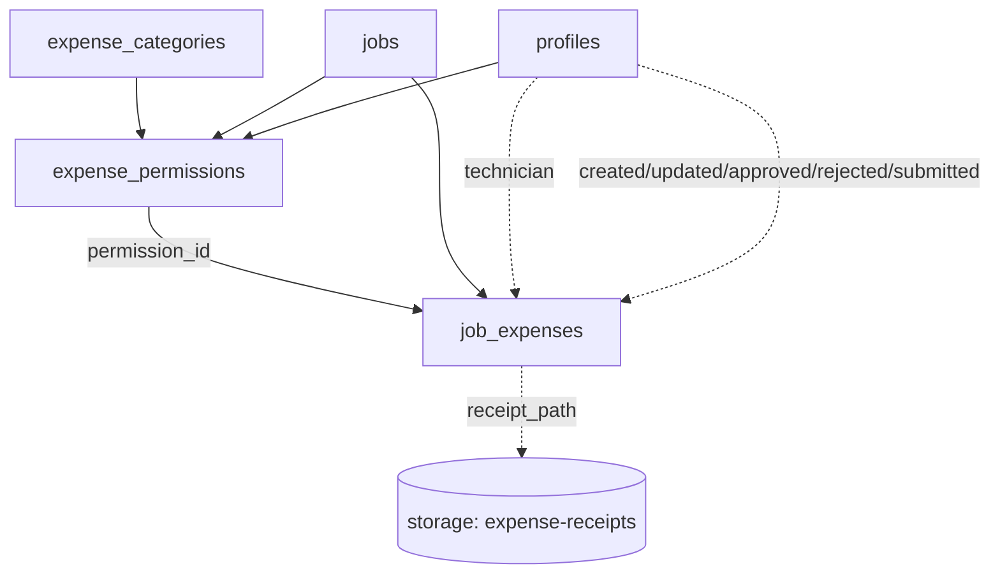

# Technician Expenses Schema & Security

This document captures the persistence and security model that backs the upcoming technician expense workflow. It should be treated as the canonical reference for future UI work, API extensions, and edge-function automation around expenses.

## Data Model Overview

The migration adds three core tables plus supporting metadata:

- **`expense_categories`** — lookup rows that drive the selectable categories in the UI. Each category includes Spanish labels, receipt requirements, and default caps that downstream permissions inherit.
- **`expense_permissions`** — per-job allowances that management grants to a technician for a category. These rows gate insert access and expose the caps/validity windows that should be enforced client-side. Each permission carries a stable `id` so runtime logic can reference the exact grant that allowed an expense.
- **`job_expenses`** — the actual expense submissions captured against a job. Every record references the permission used, stores multi-currency values, and tracks workflow state (`draft → submitted → approved/rejected`) with a JSON `status_history` trail.
- **`expense_status` enum** — shared enum (`draft`, `submitted`, `approved`, `rejected`) used by the workflow.
- **`expense-receipts` storage bucket** — private bucket that stores uploaded receipts. Paths are referenced from `job_expenses.receipt_path`.

### Entity Relationship Diagram



## Table Details

### `expense_categories`
- Primary key: `slug` (lowercase identifier shared across tables).
- Flags: `requires_receipt`, `is_active` and default EUR caps (`default_daily_cap_eur`, `default_total_cap_eur`).
- Seeded values: Dietas, Transporte, Alojamiento, Material, Otros (with representative cap defaults).
- Intended to be rarely modified — changes should come from migrations or management tooling.

### `expense_permissions`
- Primary key: (`job_id`, `technician_id`, `category_slug`) with a generated `id` UUID for stable references.
- Optional validity window (`valid_from`, `valid_to`) and cap overrides.
- Audit fields (`created_at/by`, `updated_at/by`) to trace who granted the allowance.
- Cascades with `jobs`/`profiles` so cleanup happens automatically when a job or technician is removed.

### `job_expenses`
- Primary key: surrogate `id` (`uuid`, defaults to `gen_random_uuid()`).
- References the permission that authorized the submission via `permission_id`.
- Multi-currency support: `amount_original` + `currency_code` + `fx_rate` + normalized `amount_eur` (auto-derived by trigger).
- Workflow timestamps/actors: `submitted_by/at`, `approved_by/at`, `rejected_by/at`, plus `rejection_reason`.
- `status_history` JSON array captures every transition (`status`, `changed_at`, `changed_by`).
- Stores receipt linkage via `receipt_path` into the private `expense-receipts` bucket.
- Partial index (`job_expenses_status_pending_idx`) accelerates queries for submitted-but-unreviewed expenses.

## Row-Level Security (RLS)

RLS is enabled and forced on all three tables. Policies share a common role-check pattern against `profiles.role` using the caller's `auth.uid()`:

| Table | Policy | Roles | Operation | Notes |
| --- | --- | --- | --- | --- |
| `expense_categories` | `Expense categories readable` | Any authenticated user, service role | `SELECT` | Keeps lookups private to signed-in users while allowing service integrations. |
| `expense_permissions` | `Management manages expense permissions` | `admin`, `management`, service role | `ALL` | Full CRUD reserved for management tiers. |
|  | `Technicians read own permissions` | `technician` (or other self) | `SELECT` | Allows technicians to discover the caps and validity granted to them. |
| `job_expenses` | `Management manages job expenses` | `admin`, `management`, service role | `ALL` | Grants full visibility and mutation rights for reviewers. |
|  | `Technicians read own expenses` | Expense owner | `SELECT` | Limits technicians to viewing their own submissions. |
|  | `Technicians insert expenses` | Expense owner | `INSERT` | Requires a matching active permission (valid window + category). |
|  | `Technicians update draft expenses` | Expense owner | `UPDATE` | Only allowed while the current status is `draft`, preventing edits after submission. |

> **Key point:** because the insert policy validates against `expense_permissions`, revoking or expiring a permission immediately revokes a technician's ability to submit new expenses for that job/category.

## Automation & Workflow Helpers

Several security-definer functions and triggers provide the workflow guarantees required by the UI and payout engines:

### Triggers
- **`set_job_expense_amounts`** — derives `amount_eur`, uppercases `currency_code`, and keeps `updated_at` current on every insert/update.
- **`maintain_job_expense_status_history`** — appends status change entries (including actor + timestamp) and seeds the history on first insert.
- **`enforce_job_expense_status_transitions`** — prevents regression from `approved/rejected` back to mutable states and ensures submissions only move to `approved/rejected` via the approval RPC.

### RPC Helpers
- **`can_submit_job_expense(job_id, technician_id, category_slug, expense_date, amount_original, currency_code, fx_rate default 1)`** → `{ allowed, reason, permission_id, remaining }`
  - Centralized permission math used by the client and server helpers. Validates date windows, caps (daily + total), and returns the specific permission row that allowed the submission.
- **`submit_job_expense(...)`** → `job_expenses`
  - Validates via `can_submit`, enforces receipt requirements, stamps `submitted_by/at`, and inserts a row directly into `job_expenses` with status `submitted`.
- **`approve_job_expense(expense_id, approved, rejection_reason)`** → `job_expenses`
  - Management-only wrapper that transitions a submitted record to `approved` or `rejected`, populating the appropriate audit columns.
- **`set_expense_permission(...)`** → `expense_permissions`
  - Upserts a permission row with proper audit stamping, letting manager surfaces edit allowances inline.
- **`replace_job_expense_receipt(expense_id, new_path, remove := false)`** → `job_expenses`
  - Handles re-uploads/soft deletions of receipts, updating audit metadata and marking the previous storage object as retired.

## Aggregations & Reporting

- **`v_job_expense_summary`** — per job/technician/category rollup that includes status counts, EUR totals by status, and the latest receipt timestamp. The view respects RLS because it projects from `job_expenses`.
- **`v_job_tech_payout_2025`** — now includes `expenses_total_eur` and an `expenses_breakdown` JSON payload so downstream tooling (rates dashboards, payout emails) can render expenses alongside timesheets/extras. Approved totals combine all three sources, while pending expenses remain separate.
- **`get_job_total_amounts`** — updated to incorporate expense data into job-level approvals. Returns:
  - `total_approved_eur` (timesheets + extras + approved expenses)
  - `total_pending_eur` (pending timesheets + pending expenses)
  - `pending_item_count` (number of submitted-but-unreviewed items)
  - `expenses_total_eur`, `expenses_pending_eur`, and `expenses_breakdown` for manager dashboards.

## Storage Security

- Bucket: `expense-receipts` (private).
- Policies:
  - Owners may upload/read/update/delete their own files.
  - Management roles (`admin`, `management`) and the service role may read, update, or delete any receipt for review workflows or server-side automation.
- Client uploads should write files to this bucket and persist the resulting path on the `job_expenses` row. Paths are relative to the bucket root (e.g. `job/<job_id>/<uuid>.pdf`).

## Sample Queries & Checks

### Verify a Permission Via RPC

```sql
select *
from can_submit_job_expense(
  'job-uuid',
  'tech-uuid',
  'dietas',
  current_date,
  25.00,
  'EUR'
);
```

### Submit an Expense (Server-side Helper)

```sql
select submit_job_expense(
  p_job_id => 'job-uuid',
  p_category_slug => 'dietas',
  p_expense_date => current_date,
  p_amount_original => 25.00,
  p_currency_code => 'EUR',
  p_description => 'Per diem'
);
```

### Approve or Reject

```sql
select approve_job_expense(
  p_expense_id => 'expense-uuid',
  p_approved   => false,
  p_rejection_reason => 'Need a VAT receipt'
);
```

### Manager Dashboard Rollup

```sql
select *
from v_job_expense_summary
where job_id = 'job-uuid';
```

## Extending the Workflow

- Adjustments to caps or categories should happen in migrations so Supabase type generation stays accurate.
- Future UI should surface validation errors that originate from the insert policy/RPC (e.g. permission expired, missing receipt when required).
- Automation such as reminders or bulk approvals can safely run with the service role by calling the RPC helpers; the functions already bypass RLS responsibly.
- When expanding reporting, prefer building atop `v_job_expense_summary` or `v_job_tech_payout_2025` to guarantee consistent totals with the job dashboard.

Keep this document close when iterating on the technician expense experience—schema changes or new flows should update both the migration layer and this reference.
