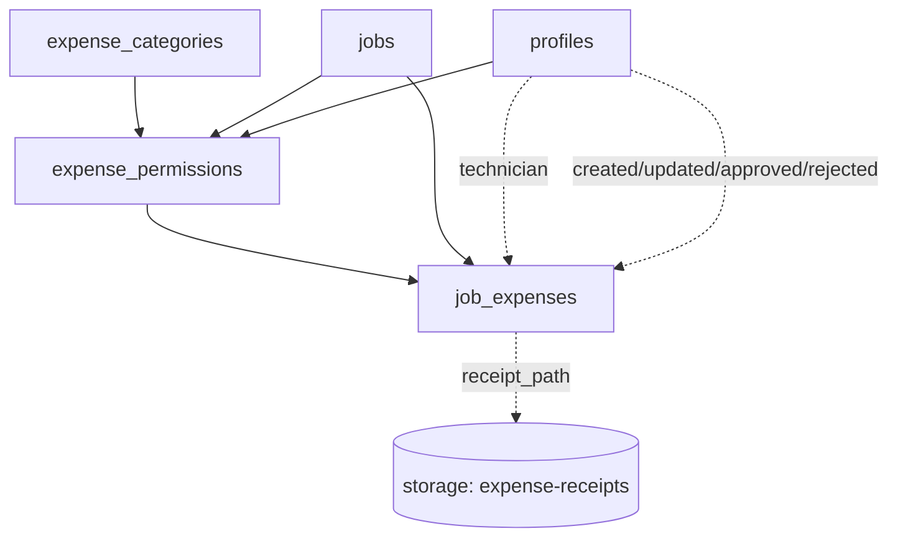

# Technician Expenses Schema & Security

This document captures the persistence and security model that backs the upcoming technician expense workflow. It should be treated as the canonical reference for future UI work, API extensions, and edge-function automation around expenses.

## Data Model Overview

The migration adds three core tables plus supporting metadata:

- **`expense_categories`** — lookup rows that drive the selectable categories in the UI. Each category includes Spanish labels, receipt requirements, and default caps that downstream permissions inherit.
- **`expense_permissions`** — per-job allowances that management grants to a technician for a category. These rows gate insert access and expose the caps/validity windows that should be enforced client-side.
- **`job_expenses`** — the actual expense submissions captured against a job. Every record references the related permission, stores multi-currency values, and tracks workflow state (`draft → submitted → approved/rejected`).
- **`expense_status` enum** — shared enum (`draft`, `submitted`, `approved`, `rejected`) used by the workflow.
- **`expense-receipts` storage bucket** — private bucket that stores uploaded receipts. Paths are referenced from `job_expenses.receipt_path`.

### Entity Relationship Diagram



## Table Details

### `expense_categories`
- Primary key: `slug` (lowercase identifier shared across tables).
- Flags: `requires_receipt`, `is_active` and default EUR caps (`default_daily_cap_eur`, `default_total_cap_eur`).
- Seeded values: Dietas, Transporte, Alojamiento, Material, Otros (with representative cap defaults).
- Intended to be rarely modified — changes should come from migrations or management tooling.

### `expense_permissions`
- Primary key: (`job_id`, `technician_id`, `category_slug`).
- Optional validity window (`valid_from`, `valid_to`) and cap overrides.
- Audit fields (`created_at/by`, `updated_at/by`) to trace who granted the allowance.
- Cascades with `jobs`/`profiles` so cleanup happens automatically when a job or technician is removed.

### `job_expenses`
- Primary key: surrogate `id` (`uuid`, defaults to `gen_random_uuid()`).
- References `expense_permissions` (composite FK) ensuring every record ties to an approved allowance.
- Multi-currency support: `amount_original` + `currency_code` + `fx_rate` + normalized `amount_eur`.
- Workflow timestamps/actors: `submitted_at`, `approved_at/by`, `rejected_at/by`, plus `rejection_reason`.
- Stores receipt linkage via `receipt_path` into the private `expense-receipts` bucket.
- Partial index (`job_expenses_status_pending_idx`) accelerates queries for submitted-but-unreviewed expenses.

## Row-Level Security (RLS)

RLS is enabled and forced on all three tables. Policies share a common role-check pattern against `profiles.role` using the caller's `auth.uid()`:

| Table | Policy | Roles | Operation | Notes |
| --- | --- | --- | --- | --- |
| `expense_categories` | `Expense categories readable` | Any authenticated user, service role | `SELECT` | Keeps lookups private to signed-in users while allowing service integrations. |
| `expense_permissions` | `Management manages expense permissions` | `admin`, `management`, service role | `ALL` | Full CRUD reserved for management tiers. |
|  | `Technicians read own permissions` | `technician` (or other self) | `SELECT` | Allows technicians to discover the caps and validity granted to them. |
| `job_expenses` | `Management manages job expenses` | `admin`, `management`, service role | `ALL` | Grants full visibility and mutation rights for reviewers. |
|  | `Technicians read own expenses` | Expense owner | `SELECT` | Limits technicians to viewing their own submissions. |
|  | `Technicians insert expenses` | Expense owner | `INSERT` | Requires a matching active permission (valid window + category). |
|  | `Technicians update draft expenses` | Expense owner | `UPDATE` | Only allowed while the current status is `draft`, preventing edits after submission. |

> **Key point:** because the insert policy validates against `expense_permissions`, revoking or expiring a permission immediately revokes a technician's ability to submit new expenses for that job/category.

## Storage Security

- Bucket: `expense-receipts` (private).
- Policies:
  - Owners may upload/read/update/delete their own files.
  - Management roles (`admin`, `management`) and the service role may read/delete any receipt for review workflows or server-side automation.
- Client uploads should write files to this bucket and persist the resulting path on the `job_expenses` row. Paths are relative to the bucket root (e.g. `job/<job_id>/<uuid>.pdf`).

## Sample Queries & Checks

### Verifying Permission Before Insert

```sql
SELECT EXISTS (
  SELECT 1
  FROM expense_permissions ep
  WHERE ep.job_id = 'job-uuid'
    AND ep.technician_id = 'tech-uuid'
    AND ep.category_slug = 'dietas'
    AND (ep.valid_from IS NULL OR CURRENT_DATE >= ep.valid_from)
    AND (ep.valid_to IS NULL OR CURRENT_DATE <= ep.valid_to)
);
```

### Approving an Expense (run as management)

```sql
UPDATE job_expenses
SET status = 'approved',
    approved_at = timezone('utc', now()),
    approved_by = auth.uid(),
    updated_at = timezone('utc', now()),
    updated_by = auth.uid()
WHERE id = 'expense-uuid' AND status = 'submitted';
```

### Listing Pending Reviews for a Job

```sql
SELECT id,
       technician_id,
       expense_date,
       amount_eur,
       receipt_path
FROM job_expenses
WHERE job_id = 'job-uuid'
  AND status = 'submitted'
ORDER BY expense_date;
```

## Extending the Workflow

- Adjustments to caps or categories should happen in migrations so Supabase type generation stays accurate.
- Future UI should surface validation errors that originate from the insert policy (e.g. permission expired, no receipt attached when required).
- Automation such as reminders or bulk approvals can safely run with the service role and bypass RLS checks already accounted for in the policies.

Keep this document close when iterating on the technician expense experience—schema changes or new flows should update both the migration layer and this reference.
